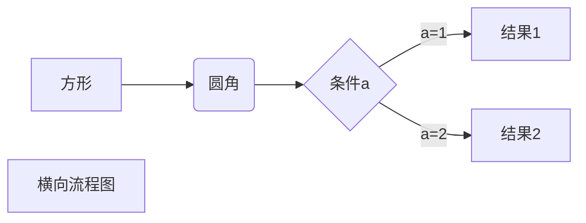

# water.js     
[](README-en.md)


water.js是一个如何编写一个好玩的readMe的示范例子，它具有以下特点
+ 正式性： 一看就知道这个库是认真写的
+ 优雅性： 给人以美好的视觉感受，和其他黑白两色的readMe区分开来
+ 装笔性：  有利于向他人展示自己代码的美好的一面

## Installation
```
npm install water-js
```
## Examples
```js
const { water } = require('water-js')

function print() {
  const content = water(true);
  console.log(content);
}
```
output
```
// 输出
我就是来水的
```
$$
\begin{Bmatrix}
   a & b \\
   c & d
\end{Bmatrix}
$$
$$
\begin{CD}
   A @>a>> B \\
@VbVV @AAcA \\
   C @= D
\end{CD}
$$





## License
Water.js is MIT licensed.
